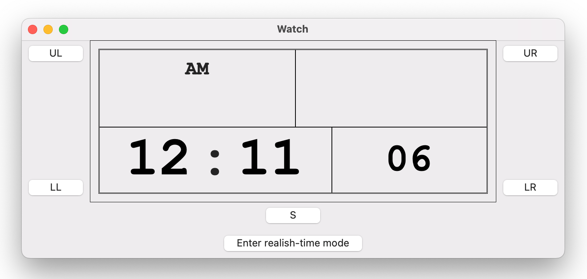

# RacketEsterelWatch

***A transpilation of Gérard Berry's Esterel wristwatch implementation from 1989 into Racket-Esterel.***

- **Authors**: Bennett Lindberg and Nathaniel Hejduk
- **Additional Credits**: Gérard Berry and Professor Robby Findler

## What is it?

RacketEsterelWatch is a Racket-Esterel implementation of [Gérard Berry](http://www-sop.inria.fr/members/Gerard.Berry/)'s Esterel [wristwatch](https://www.researchgate.net/publication/43611052_Programming_a_digital_watch_in_Esterel_v3) from 1989. The implementation, which was written alongside Ph.D. student [Nathaniel Hejduk](https://scholar.google.com/citations?user=0wfmTeAAAAAJ&hl=en), transpiles Berry's original Esterel code for the wristwatch into a development build of [Esterel implemented in Racket](https://docs.racket-lang.org/esterel/) by Professor Robby Findler. The goal of the project was to empirically examine the feasibility of development and runtime performance of Racket-Esterel.

[Esterel](https://www-sop.inria.fr/meije/esterel/esterel-eng.html) is a programming language originally created in the 1980s that features signal-based state and control flow as well as paused-based synchronous parallelism. In Esterel, parallel threads are periodically synchronized at explicit pause points in the program where all threads must pause and resolve signal presences before any thread continues. Signals may be emitted or not between each pause point. Esterel is may be understood in comparison to finite-state machines or clocked digital circuits.

## Features



RacketEsterelWatch implements a graphical user interface (GUI) for interacting with the wristwatch. This GUI is designed to match the wristwatch implemented by Berry in 1989. The wristwatch displays the time to the nearest second and its behavior is manipulated by the following buttons:
- The `S` button increments the time by one second.
- The `Enter realish-time mode` button causes the watch to increment the time automatically. The seconds on the clock's time will increment at roughly one second intervals, depending on the execution speed of the Racket-Esterel code and GUI code.
- The `UL`, `UR`, `LL`, and `LR` buttons perform different actions depending on the mode the watch is in.

The wristwatch has two modes, one for displaying the watch time and another for setting the watch time.

- In the display mode, the time can be incremented to simulate actual time passing and the time mode can be swapped between 24-hour mode and AM-PM mode.
- In the set-time mode, the time can be changed by hours, minutes, and seconds. The rollover behavior of the time units matches what is performed by most watches when setting the time (e.g. when rolling over from `59` to `00` seconds, the number of minutes and hours remains the same).

## Code

The implementation of the features described above becomes complicated due to the signal-based nature of Esterel programs. We provide several code examples below to highlight the use of Esterel.

```racket
; main.rkt

(define (create-watch)
  (esterel #:pre 1
           (par
            (button)
            (watch))))
```
*The code above is the entrypoint for the Racket-Esterel wristwatch program. Here, a `par` block runs two functions in parallel: `button` (to handle the pressing of the side buttons) and `watch` (to handle the time logic of the watch itself). In Esterel, threads are run in parallel where the execution behavior of each thread depends on the presence (or lack thereof) of signals. Threads can check for the presence of a given signal and opt to emit signals as well, thereby causing the emitted signals to appear present to other threads. The `button` and `watch` functions work together by emitting signals to communicate with each other during execution.*

```racket
; button.rkt

(define set-watch::LR_received
  (λ () (let loop ()
          (if (present? LR)
              (emit SET_WATCH_COMMAND)
              (void))
          (pause)
          (loop))))
```
*The code above is used to trigger the appropriate action when the `LR` button is pressed when setting the watch time. Every iteration (i.e. between pauses), the loop checks if the `LR` signal has been emitted (indicating that the `LR` button was pressed), in which case the `SET_WATCH_COMMAND` signal is emitted to trigger the saving of the watch time. Recall that each thread running in parallel will eventually reach a `pause` statement, at which point the status of each signal will be used to determine the state of the program.*

```racket
; watch.rkt

(define view-watch
  (λ ()
    (with-trap EXIT_VIEW_MODE
      (let loop ()
        (await #:cases
               [#:immediate (and (present? ENTER_SET_WATCH_MODE_COMMAND) (not (present? EXIT_SET_WATCH_MODE_COMMAND)))
                (exit-trap EXIT_VIEW_MODE)]
               [#:immediate (present? S)
                (begin (repeat 24H_MODE (set))
                       (emit WATCH_TIME (increment-time (signal-value WATCH_TIME #:pre 1 #:can (set)) 'view)))]
               [#:immediate (present? TOGGLE_24H_MODE_COMMAND)
                (begin (emit 24H_MODE (not (signal-value 24H_MODE #:pre 1 #:can (set))))
                       (repeat WATCH_TIME (set)))]
               [#:immediate #t
                (begin (repeat WATCH_TIME (set))
                       (repeat 24H_MODE (set)))])
        (pause)
        (loop)))))
```
*The code above is essentially a `switch` block that handles each action that may be performed when in display mode. For example, if the `TOGGLE_24H_MODE_COMMAND` signal is present, the code snippet emits the signal `24H_MODE` to indicate elsewhere in the program that 24-hour mode should be used instead of AM-PM mode. We can see here how signal emission and presence is used to pass around information and handle state in Esterel.*